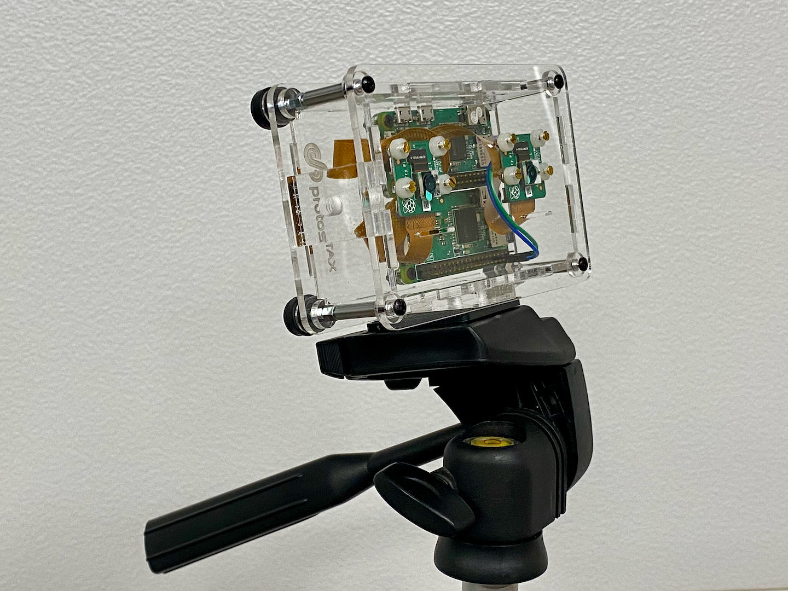
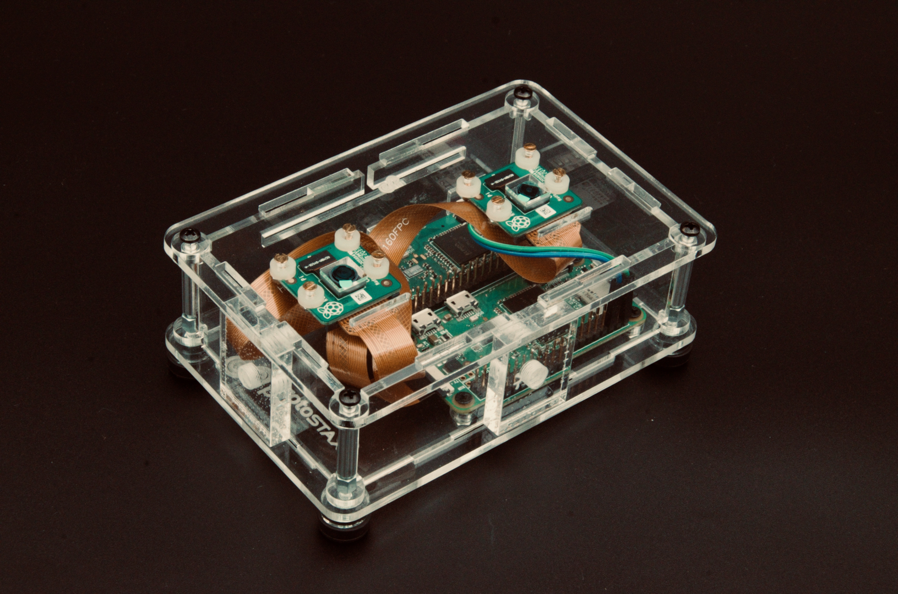

# ProtoStax_StereoscopicCameraPi
3D (Stereoscopic) Camera streamer using two Raspberry Pi Zeros and two
Pi Cameras in a ProtoStax Enclosure.
Stack with ProtoStax Enclosure for RPI UPSPack Standard V3
for a portable setup with backup power. 




using
* 2x Raspberry Pi Zero W
* 2x Pi Camera V2
* [ProtoStax for Raspberry Pi Zero](https://www.protostax.com/products/protostax-for-raspberry-pi-zero)
* [ProtoStax Stereoscopic 3D Camera Kit for Raspberry Pi Camera - 60mm Stereo Base](https://www.protostax.com/products/protostax-3d-camera-kit-for-raspberry-pi-camera)

Stack with [ProtoStax Enclosurefor RPI UPSPack Standard V3](https://www.protostax.com/products/protostax-enclosure-for-rpi-upspack-standard-v3) for a portable setup with backup power. 

For further instructions, see the
[Stereoscopic (3D) Streaming Camera and Viewer](https://www.protostax.com/blogs/news/stereoscopic-3d-streaming-camera-and-viewer)


## Prerequisites

* Enable Camera on the Raspberry Pi
* Python 3. The code assumes you are
  using Python 3!
* picamera Python library. The latest version of Raspberry Pi OS
(Bullseye) does not support picamera as Bullseye has moved to
libcamera. picamera is installed and available by default on Buster.
* Raspberry Pi OS Buster (or earlier). See above.

The program assumes that the two Raspberry Pi Zero Ws are named leftcam.local
and rightcam.local. Either name the Raspberry Pi Zero Ws as above, or
note their actual names to update in the program


## Installing

Install on each your two Raspberry Pi Zeros.

The program assumes that the two Raspberry Pi Zero Ws are named leftcam.local
and rightcam.local. Either name the Raspberry Pi Zero Ws as above, or
note their actual names to update in the program


```
git clone https://github.com/protostax/ProtoStax_StereoscopicCameraPi
```

## Usage

The program assumes that the two Raspberry Pi Zero Ws are named leftcam.local
and rightcam.local. Either name the Raspberry Pi Zero Ws as above, or
note their actual names to update in the program (stream.py)


```
cd ProtoStax_StereoscopicCameraPi
```

**NOTE - Using Python 3 or higher!**

```
python3 stream.py
```

Each program will expose an MJPG video stream of the local camera via a simple webserver of
the local video as

http://leftcam.local:8000/stream.mjpg
and
http://rightcam.local:8000/stream.mjpg

The program also has a home page (index.html) that will expose both
video streams as a stereoscopic image (side-by-side), as

http://leftcam.local:8000/
or
http://rightcam.local:8000/

(you can access the stereoscopic stream from either url)

You can open the link on your mobile phone browser and place the phone
in a 3D stereoscopic viewer like Google Cardboard (or similar viewer) to
get a 3D stereoscopic streaming camera on your viewer.

The viewer can thus see everything in 3D. The camera operator can move
around to give the viewer a 3D tour from the comfort of
their couch!

Stack with
[ProtoStax Enclosurefor RPI UPSPack Standard V3](https://www.protostax.com/products/protostax-enclosure-for-rpi-upspack-standard-v3)
for a portable setup with backup power, so the camera operator is not
bound by power cables. When the battery is low, the camera setup can
be plugged back in to provide power and also recharge the battery. 


## Running the script as a service

As an alternative, the Python script can be started during boot by creating a service - more info at https://www.raspberrypi.org/documentation/linux/usage/systemd.md

1. Edit stream.service - adjust the **WorkingDirectory** path
according to where you've installed it:

```
WorkingDirectory=/home/pi/ProtoStax_StereoscopicCameraPi
```

2. Copy the stream.service file into /etc/systemd/system as root:

```
sudo cp stream.service /etc/systemd/system/
```

3. Start the service:
```
sudo systemctl start stream.service
```

4. Check if the service is running:

```
sudo systemctl status stream.service
```

The output should be similar to:

```
● stream.service - 3D Stereoscopic Video Streamer
   Loaded: loaded (/etc/systemd/system/stream.service; disabled; vendor preset: enabled)
   Active: active (running) since Thu 2023-01-05 09:52:19 PST; 11s ago
 Main PID: 2826 (python3)
    Tasks: 9 (limit: 725)
   CGroup: /system.slice/stream.service
           └─2826 /usr/bin/python3 stream.py

Jan 05 09:52:19 leftcam systemd[1]: Started 3D Stereoscopic Video Streamer.
```

5. If the service is running fine, you can enable it and reboot the Raspberry Pi to load it automatically during boot:
```
sudo systemctl enable stream.service
```

6. To stop the service:
```
sudo systemctl stop stream.service
```


## License

Written by Sridhar Rajagopal for ProtoStax. BSD license, all text above must be included in any redistribution

A lot of time and effort has gone into providing this and other code. Please support ProtoStax by purchasing products from us!
